<div align="center">

# Cortex

### Your system, actually understood.

A real-time system monitoring desktop app that tells you the truth — what's measured live from your machine, what's a genuine network probe, and what's illustrative example data. No fake charts pretending to be real telemetry.

[](https://cortex-system.netlify.app/)

   

---

## What this actually is

Cortex started as a simple system dashboard and grew, one honest module at a time, into a full monitoring platform: live OS metrics, network diagnostics, automation, analytics, and deep personalization. The one rule that never bent as it grew: **if a number isn't real, the UI says so** — instead of quietly inventing thirty days of history the app never collected, or a firewall status it has no way to check.

Every value on screen is either:
- **Real** — read straight from `sysinfo` on the Rust side, or measured live via `fetch()`/Web APIs (public IP, speed test, DNS latency, service uptime...)
- **Clearly labeled illustrative** — tagged `exemple`/`N/D` in the UI, for the handful of things a sandboxed desktop app genuinely cannot verify (firewall rules, weather, Docker internals)

That distinction is the actual point of the project, not a footnote.

## Screenshots

<table>
<tr>
<td width="50%">
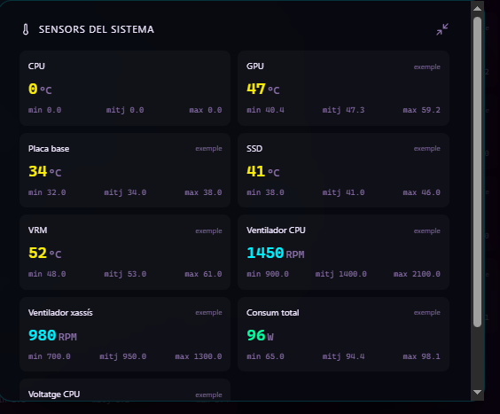
<p align="center"><b>AI System Insights</b><br/>Threshold-based observations over live metrics, animated in and out as conditions change. Rule-based and transparent about it — not dressed up as a black-box model.</p>
</td>
<td width="50%">
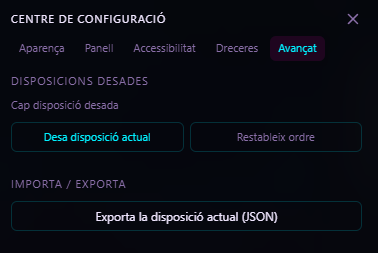
<p align="center"><b>Security Center</b><br/>SSH detection is real (checks the live process list). Everything else is honestly marked <code>EXEMPLE</code> — a browser sandbox can't inspect firewall rules or open ports.</p>
</td>
</tr>
<tr>
<td width="50%">
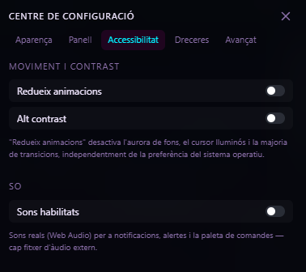
<p align="center"><b>Network Map</b><br/>A stylized radial map (not a generic world outline) showing real measured latency to six regions — genuine <code>fetch()</code> timing, not simulated numbers.</p>
</td>
<td width="50%">
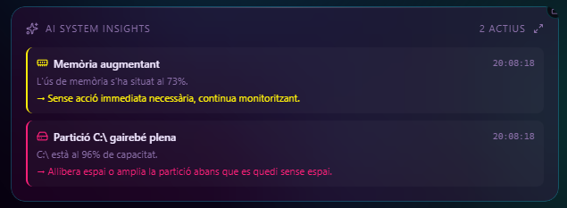
<p align="center"><b>System Sensors</b><br/>CPU temperature is real when the OS exposes a sensor. The rest is clearly tagged <code>exemple</code> instead of pretending your motherboard sensor exists when it doesn't.</p>
</td>
</tr>
</table>

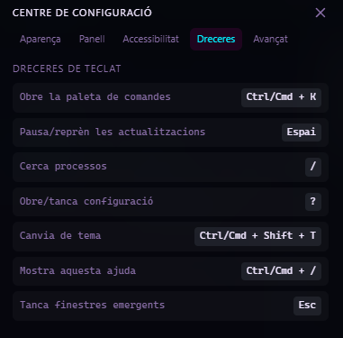
<p align="center"><b>Professional Network Suite</b> — a genuine Cloudflare-backed speed test, real bandwidth/latency/DNS measurements, and live reachability checks against 9 real services.</p>

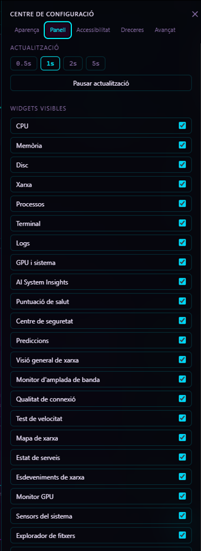
<p align="center"><b>Automation & Monitoring</b> — a visual <code>IF metric &gt; threshold THEN action</code> rule engine evaluated every tick against real state, a live-countdown task scheduler, and an incident center.</p>

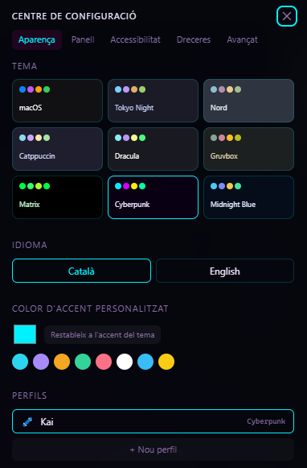
<p align="center"><b>Advanced Analytics</b> — a real, persistent history store (sampled ~1/min). No fake "30 days" of history on first launch: the UI tells you exactly how much real data it's collected so far.</p>

<details>
<summary><b>More screenshots</b> — settings, personalization, and the rest of the dashboard</summary>
<br/>

<table>
<tr>
<td width="30%">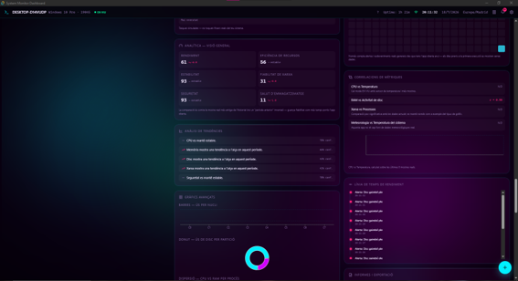<p align="center">9 built-in themes, a live CA/EN language switcher, custom accent colors, and profiles — all driven by CSS custom properties.</p></td>
<td width="50%">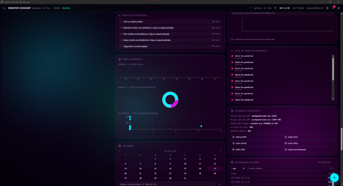<p align="center">A floating action menu with real wired actions: speed test, snapshot, export, theme switch, fullscreen.</p></td>
</tr>
<tr>
<td width="50%">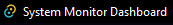<p align="center">Live process table (search/sort/context menu) alongside Notes and Calendar productivity widgets.</p></td>
<td width="30%">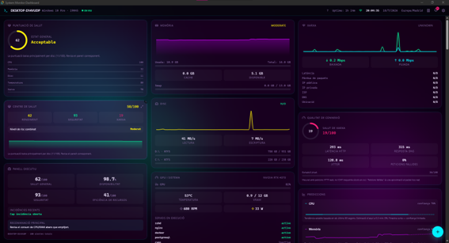<p align="center">Color-coded live system logs with filtering, next to the monthly calendar widget.</p></td>
</tr>
<tr>
<td width="10%">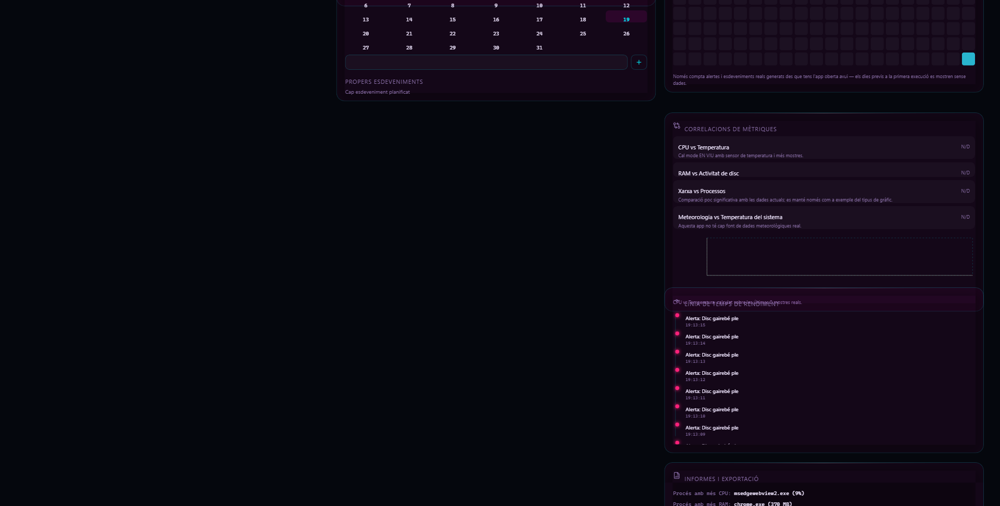<p align="center">Real Pearson correlation between metrics, and a unified timeline merging alerts, snapshots and events.</p></td>
<td width="30%">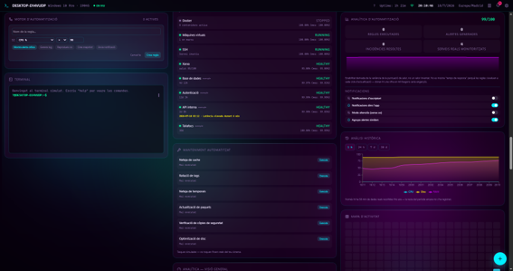<p align="center">Toggle any of the 50+ widgets on or off — the whole dashboard is yours to configure.</p></td>
</tr>
<tr>
<td width="10%">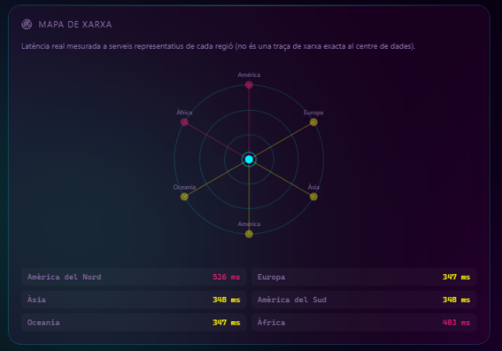<p align="center">Forced reduced-motion and high-contrast modes, independent of the OS-level preference — plus an opt-in real Web Audio sound system.</p></td>
<td width="30%">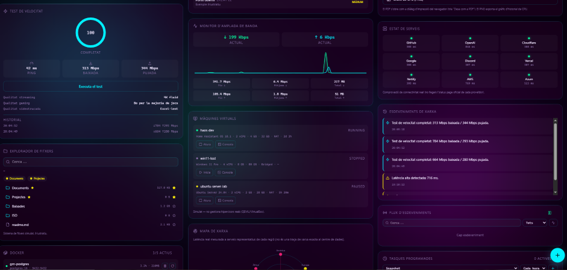<p align="center">Every keyboard shortcut in one place, from the command palette (<code>Ctrl/Cmd+K</code>) to quick theme switching.</p></td>
</tr>
</table>

</details>

## Features

### Live system metrics (real, via Tauri + `sysinfo`)
CPU (per-core usage, clock, temperature where exposed), RAM/swap, disk partitions and I/O throughput, network interfaces and bandwidth, live process list with owner and runtime.

### AI System Insights
Rule-based analysis over the live metrics: threshold-triggered observations, a weighted health score, a notification center, a security panel, and short-horizon predictions via real linear regression with honestly-capped confidence.

### Professional Network Suite
Public IP/ISP/geolocation, live bandwidth monitor, connection quality (real HTTP latency, DNS response time, jitter), a genuine Cloudflare-backed speed test, a radial world-latency map, live status checks for 9 real services, and a network event stream.

### Advanced System Tools
Process inspector, GPU monitor, sensor dashboard, a simulated file explorer/Docker panel/VM manager/package manager (explicitly simulated — OS-level control from a browser isn't possible), a storage treemap, real snapshot capture with side-by-side diffing, and a full export center.

### Personalization & Productivity
9 built-in themes plus a custom accent color picker, a live **Catalan/English** language switcher, drag-and-drop widget reordering, saved layouts, user profiles, a command palette (`Ctrl/Cmd+K`), notes, a calendar, and an in-app clipboard history.

### Automation & Monitoring
A visual rule engine (`IF metric > threshold THEN action`) evaluated every tick against real state, a task scheduler with live countdowns, a service/uptime monitor, an incident center, and automation analytics.

### Advanced Analytics
A **real, persistent** history store (sampled ~1/min, retained up to 3 days) — deliberately not padded with fake long-range history the app never collected. Time-range views, a GitHub-style activity heatmap, trend detection, metric correlations, a unified performance timeline, and a full report/export center.

### Premium UX & Motion
A shared spring-based motion system, cursor-reactive aurora background, a free fullscreen toggle on every widget, context menus, a real Web Audio sound system (opt-in), and a dedicated accessibility tab.

### Production-grade engineering
34 real unit tests (Vitest), CI running lint + typecheck + build + test on every push, per-widget error boundaries, code-split lazy loading, `aria-label`s and focus trapping on every modal, a real PWA manifest + offline-capable service worker, and a real dashboard screenshot export.

## Tech stack

| Layer | Choice |
|---|---|
| UI framework | React 19 + TypeScript (strict) |
| Build tool | Vite 8 |
| Styling | Tailwind CSS v4 (CSS-first config) |
| State | Zustand (6 domain stores, `persist` middleware where relevant) |
| Charts | Recharts (line, area, bar, donut, scatter, radar, treemap) |
| Animation | Framer Motion (shared spring presets) |
| Desktop shell | Tauri v1 (Rust) |
| System metrics | `sysinfo` crate |
| Testing | Vitest |
| i18n | Custom lightweight dictionary system (CA/EN) |
| Icons | Lucide React |

## Architecture

```
src/
  store/            Six Zustand stores, one per domain:
                       systemStore        — live OS metrics + tick loop
                       networkSuiteStore  — real network probes
                       toolsStore         — process inspector, Docker/VM sim, snapshots
                       personalizationStore — themes, layout order, profiles, notes, locale
                       automationStore    — rule engine, scheduler, incidents
                       analyticsStore     — persistent real history
  lib/              Pure functions: math (correlation, regression), export
                     utilities, theme tokens, sound synthesis, network probes, i18n
  lib/i18n/          Translation dictionaries (ca.ts, en.ts) + useT() hook
  hooks/            One polling hook per store, composed into a single master loop
  components/
    layout/         Header, AuroraBackground, DraggableWidget, CursorGlow
    panels/         ~50 self-contained widget components
    ui/             Shared primitives: Card, ProgressBar, RadialGauge, StatTile,
                     ContextMenu, EmptyState, Skeleton, WidgetErrorBoundary
  types/            Domain types, one file per module
src-tauri/          Rust backend: a single `get_snapshot` command reading
                     real CPU/RAM/disk/network/process data via `sysinfo`
```

**Why this shape works:** nearly every visual concern (color, glass effect, spacing, animation timing) lives in `Card` and a handful of CSS custom properties. Features added later (themes, fullscreen, error boundaries, i18n) reach the whole app by touching that one shared layer, rather than 50 individual panel files.

## Getting started

### As a desktop app (real OS metrics)

Requires Rust ([rustup.rs](https://rustup.rs)) and Tauri's platform prerequisites — see the [official guide](https://tauri.app/v1/guides/getting-started/prerequisites).

```bash
npm install
npm run tauri dev      # development, opens a native window
npm run tauri build    # produces an installer for your OS
```

### As a web app (simulated data)

```bash
npm install
npm run dev
```

Or just use the **[live preview](https://cortex-system.netlify.app/)** — same code, simulated mode.

### Scripts

| Command | What it does |
|---|---|
| `npm run dev` | Vite dev server, browser preview |
| `npm run build` | Type-check + production build |
| `npm run test` | Run the Vitest suite |
| `npm run lint` | Lint with oxlint |
| `npm run tauri dev` | Desktop app, dev mode |
| `npm run tauri build` | Desktop installer for the current OS |

## Deployment

- **Desktop installers**: `npm run tauri build` produces a platform-native installer. Cross-compiling isn't practical with Tauri — use the included GitHub Actions workflow (`.github/workflows/build.yml`) to build Windows/macOS/Linux from CI on a tag push.
- **Web preview**: `npm run build` outputs a static `dist/`, deployable anywhere (this project's own preview runs on Netlify). The service worker caches only the app shell — live features degrade gracefully offline rather than serving stale fake data.
- No environment variables required; every external call uses public, keyless endpoints.

## Roadmap

All eight planned modules are implemented, plus a production-readiness audit and partial internationalization. Known, intentionally-scoped gaps (documented rather than hidden):

- Full i18n coverage — chrome, settings, and every widget title are translated; deeper per-widget copy is still Catalan-only in places
- True drag-*resize* (only reorder is implemented)
- Full chart zoom/pan (time-range selection substitutes for this)

## Contributing

Keep the "real vs. illustrative" labeling convention if you fork this — it's the project's core value, not decoration. Run `npm run build && npm run test` before opening a PR.

## License

MIT.
